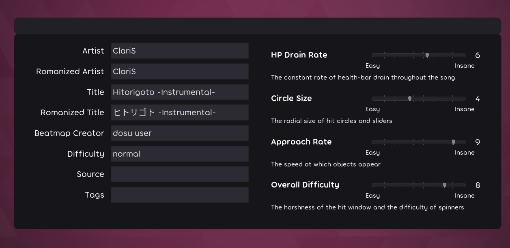
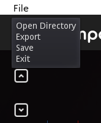
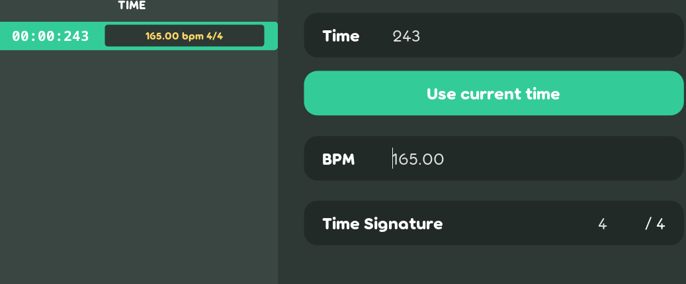
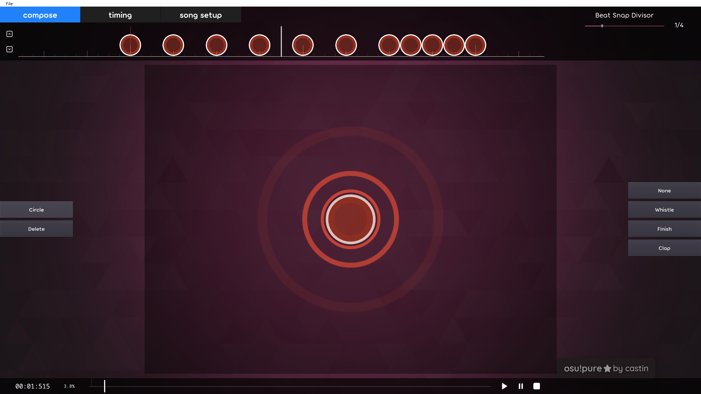
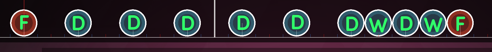
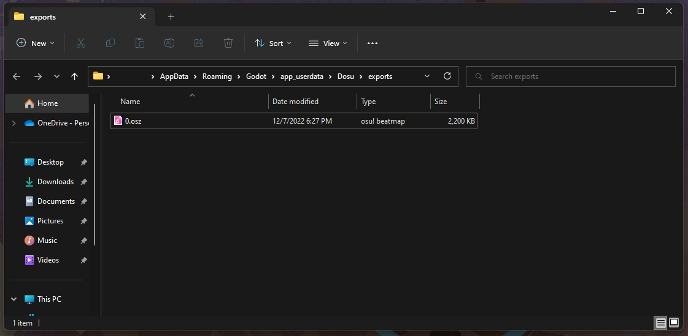

# Tutorial

This tutorial assumes that the project has been built and is able to run. Please watch the following videos to have a better understanding of how the editor is used. You can also check out the **Features Implemented** section of the final report to see what's implemented.

### Videos

- [Presentation](https://www.youtube.com/watch?v=ZM7tXxpm3rc)
- [Trailer](https://www.youtube.com/watch?v=kaH1BPfvzns)

### Documents

- [Final Report](pdf/cs354r-final-report.pdf)

## Creating the map

For this tutorial, we'll be mapping a short instrumental version of the song Hitorigoto by ClariS. You can find the audio file and background we'll be using [here](https://utexas.box.com/s/qsbrv3yy2k5tuqua5v3m5zc76e2mpig9).

Upon launching the game. Go to the edit screen and drag and drop the `audio.mp3` file. This will create a new beatmap with given audio. 

It'll bring up the `song setup` tab, and we should edit the song/map metadata so we know what song this beatmap is using. To keep it simple, let's just edit the following:

- **Artist**: ClariS
- **Romanized Artist**: ClariS
- **Title**: Hitorigoto -Instrumental-
- **Romanized Title**: ヒトリゴト -Instrumental-
- **Difficulty**: normal

You should have something like this:

Feel free to edit anything else here, even the difficulty settings to the right. Just make sure to save your changes in the top right!

## Timing

Let's move onto timing our song, so we can then start placing circles. Click on the `timing` tab to change the display.

For this song, the bpm is constantly 165 and begins at 243 milliseconds with a time signature of 4/4. 

Great! Now we can get onto mapping!

## Mapping

Click on the `compose` tab to get to where we'll be able to start placing objects. 

We can start by playing the song and listening to where the beats are. As you can hear, there are beats on every 1/2 ticks, i.e. red and white ticks if your Beat Snap Divisor is on 1/4. Because we're just getting started, let's make an easy map for now. Let's place a circle on every white tick and towards the end of the second measure we can also add two circles on the red ticks to emphasize the instruments there.

You should have something like this.

Let's add some hit sounds to these circles. We won't hear the difference in sound in the editor, but we'll hear the difference in game.

On the first and last circle, you can hear a finish sound, so we can put finishes on those. Between those two, every white tick, you can hear a clap, so apply claps to those. The remaining two circles on the red ticks towards the end, are whistles. 

Here's an image to better demonstrate this.
- **F** - Finish
- **D** - Drum
- **W** - Whistle

We're just about ready to test our beatmap, but first let's add in that background. Drag and drop the `bg.jpg` file from earlier and make sure to save your changes!

It should now look like this.

## Exporting

To test our beatmap, we need to export it. Exporting will require having [7zip](https://www.7-zip.org/) installed, so make sure you have it installed to use this feature. 

Once you have 7zip, go to the top left, click on `File` and then on `Export`. This will create a `.osz` file and open the `exports` directory for you to see.

Simply double click it, and it should automatically import into osu! if you have it installed. From there, you can test your map!

## Completing the map

All that's left is finishing the map you started, and all you need to do is listen to the beats. If you just want to see the map completed, here's a [completed version](https://utexas.box.com/s/dyjz9k7cw3w58eteq4c18711eej9znf6).

You can copy the `.osu` file and override your current one. Go to the top left, click on `File` and then `Open Directory` to see the directory your beatmap is stored in. You can then replace your file. To update the editor in game without restarting the game, you can click on `Exit` under `File` to get to the edit screen. Click on the `Refresh` button to reload your beatmaps, and it should be updated.

## More examples

[Here](https://utexas.box.com/s/dlo5rd4x194oah9mc5osa3zuajzha7d6) are two songs that showcase some more features of the editor.

- Hanatachi ni Kibou o
  - `01:14:458` - Has 1/3 rhythms and then transitions to 1/4 at `01:24:245`
- Yoake no Bell ga Naru
  - Starts at 177 bpm then slows down starting at `03:50:777`

You can drag both of these folders into your `songs` directory and reload your beatmaps to see them.

Happy mapping!